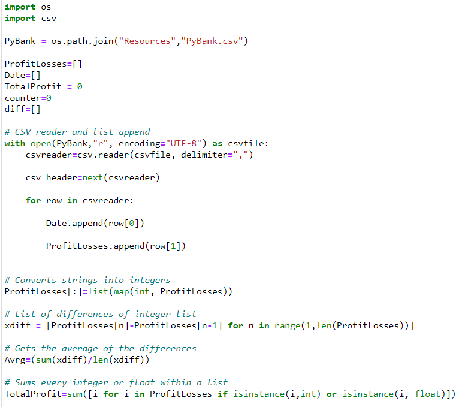
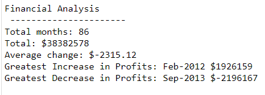
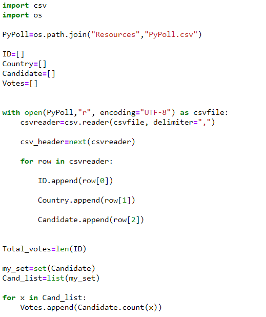
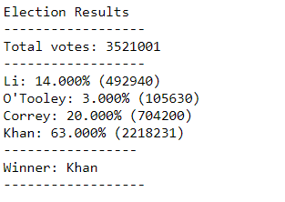

# Python Analysis - Poll and Income Data

## By Erick Hernandez

For this project, I had to make an analysis for two different datasets that were about election results and income data for a given timeframe.

### Bank Analysis

For the income analysis, I had to first read it from the attached csv file and map it into integers for further operations. I performed an average from the difference between each element and total sum of them.

The results were:

---

### Polls Analysis

With the elections analysis, I created a count loop using set option in order to identify the participants and subsequently adding a count for each one of them.

After that, I printed out the winner candidate to a text file.

---